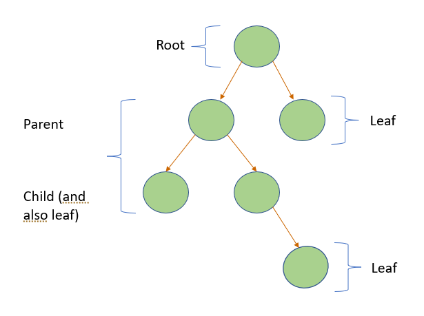
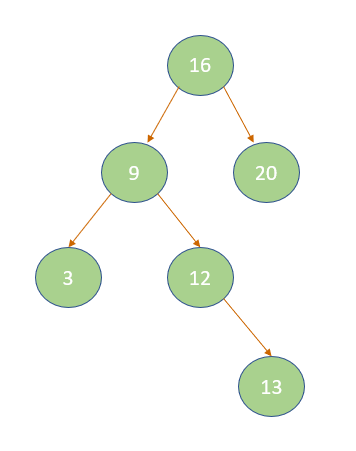

# Binary Trees
## Introduction
Trees are another basic type of data structure. We will talk about binary trees specifically. Binary trees are an efficient way to sort information that can be easily searched for and found later. Binary trees can be used for 3D games, routers, and search methods. 

## Explanation
Imagine an upside-down plant. That's what a binary tree looks like! The very first node is called the root and the very last nodes or the nodes on the tip of the tree are called the leaves. Each node can point to two nodes. This makes it look like a branch. The node pointing to two other nodes is called the parent node and the nodes beneath or pointed to by the parent node are called child nodes. 
<br>
<br>
<br>


### Binary Search Tree
Let's talk about a particularly useful type of binary tree: a binary search tree. When we put new information into a binary tree, we can organize our tree so that it is easier to search through and find the information that we want. We start at the root and compare the information value with the value of the root. If the value is greater than the root, we go to the right branch, but if it is less than the root we go to the left branch. Next we compare the value we have with the next node on the branch we went down. Is it greater than or less than? And we choose left or right accordingly until we get to the last node. We insert it as a leaf at the end of the branches. 
<br>
<br>


Let's say for example we want to insert 11 into our tree. Is it greater than or less than 16? Less than...so we go to the left branch. Is it greater or less than 9? Greater than...so we go to the right. Greater than or less than 12? Less than...so we put it under 12 on the left side. 

### Recursion
Now there is one more important topic to run over before we look at some code. To look through binary trees, we use recursion. Recursion is when you call the function inside of itself to re-run through the function. For example:
```python
def hi()
    print("hi!")
    hi()
```
This function would run forever! It would infinitely print out hi. So we have to have a base case, or a condition that will make it stop. This could be a counter 

```python
def start()
    count = 0
    hi(count)

def hi()
    count += 1
    if count < 5    
        print("hi!")
        hi(count)
    else
        print("bye")
```
The base case is when the count value gets up to 5, then the recursion will stop. Notice how we cannot initialize count in the hi() because then count would always equal zero! Thus, we have to initialize it elsewhere and call the hi() function first in the start() function. 
## Performance


## Code Example

## Practice