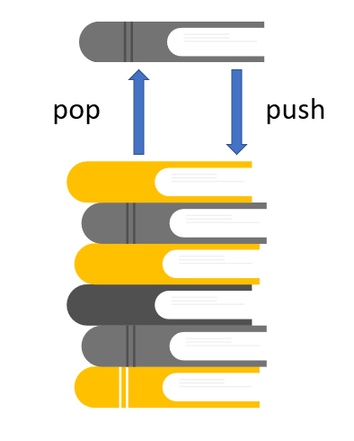

# Stacks
## Introduction
A stack is a unique data structure used to keep track of the order of items. It is known as a LIFO, or "last in and first out". Have you ever wondered what happens when you press the "undo" button on a word document? The program removes the last thing you did to the document. What happens if you press the "undo" button again? It undos another one of the last things you did to the document. Notice that it doesn't make any changes to what you did when you very first started typing on the document.
Rather, it undos the latest or last change you made. This is an example of a stack and how it is commonly used. 


## Explanation
A stack contains a list of information where each new piece of information is put in the back of the line. We use the keyword "push" to add this piece. Next, we can only take away information from the back of the list using the keyword "pop". Be careful though! "Pop"ing off of the list deletes that piece of information forever. So if you are removing something from the list, you cannot get it back again. 
<br>
<br>
<br>


To help you remember, think of a stack of books on the floor. You can't take the book from the bottom of the stack; that would make them tip over! Instead, you have to take the books from the top of the stack. 

## Code Example
```python
stack = [] # first you create what the stack is holding. 
           # this example, we will put numbers into a list

stack.append(1) # python uses the function "append" to push 
                # a value to the end of a list

stack.append(2)
stack.append(3)

# the current output will be '1, 2, 3'

stack.pop()
# now the output is '1 , 2'

# when I pop a value, the value is gone forever! Unless...
value = stack.pop()
# now I have the popped value saved to a variable! 
# I can add it back onto the stack if I want to
stack.append(value)

```
## Performance
Luckily, stacks are highly efficient. Since we don't have to search through the stack to find what we want to push and pop (it will always be at the back), it will be O(1)

| Operation | Performance |
| --------- | ----------- |
| push()    | O(1)        |
| pop()     | O(1)        |

## Practice
Now it's your turn to try! Copy the code below and try to solve the puzzle. You are given a list of letters out of order. Your task is to put them into alpabetical order using only the stack method. Hint: create another stacked list (or two...or three) to pop the letters off of the original list and save them in another list to append back onto the original list later when you need it.

```python
alphabet = ['E', 'A', 'C', 'B', 'D']
save = alphabet.pop # remember, you can save the letter
                 # you popped by assigning it to a variable
saveLetter = []  # for you to put the popped letters into
```

[Link to Solution](Stacks/stackSolution.py)